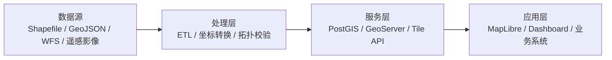

## 分层架构

推荐采用分层架构：数据层负责空间数据存储与索引，服务层负责查询、切片和权限控制，前端层负责地图渲染、交互分析和业务展示。

## 关键组件

| 组件 | 职责 | 建议选型 |
| --- | --- | --- |
| 空间数据库 | 矢量数据存储、空间索引、拓扑关系计算 | PostgreSQL + PostGIS |
| 地图服务 | WMS、WMTS、WFS、矢量切片发布 | GeoServer 或 Tegola |
| 前端地图 | 底图渲染、图层控制、空间交互 | MapLibre GL JS |
| 对象存储 | 影像、离线切片、导出文件存储 | S3 兼容存储 |

## 架构决策

### ADR-001：空间计算下沉到数据库

距离、包含、相交、缓冲区等查询由 PostGIS 执行，API 层只做参数校验、权限过滤和响应组装。

### ADR-002：展示优先采用矢量切片

业务图层以 MVT 为主，前端通过样式控制颜色、标签和筛选，降低重复切片与多端适配成本。

### ADR-003：发布链路分离

文档与前端应用走 Netlify 自动部署，数据库、GeoServer 和对象存储独立发布，减少互相影响。
